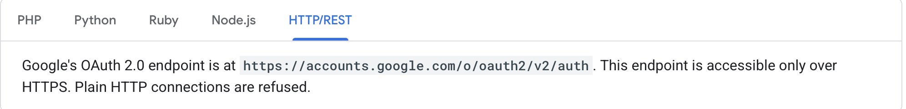
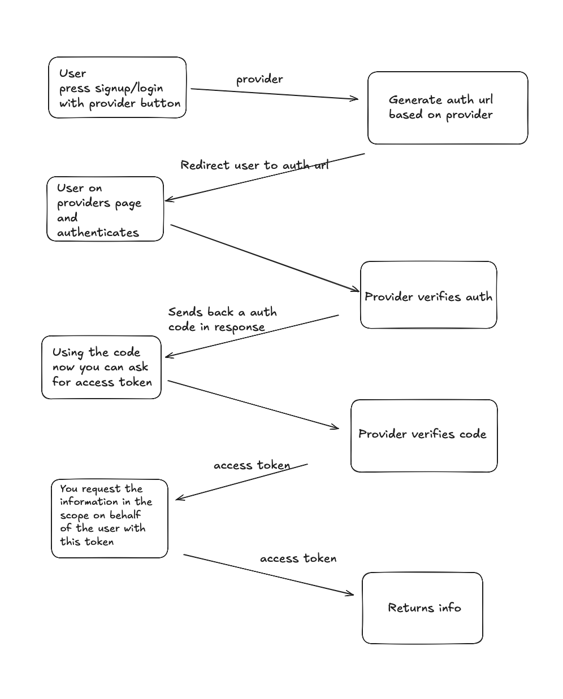

## Architecture

### OAuth Implementation (`/auth/oauth/base.ts`)

- **OAuthClient Class**: Generic OAuth 2.0 client implementation supporting Authorization Code Flow
- **Provider System**: Extensible provider configuration (currently Google and Discord)
- **Key Methods**:
  - `getAuthUrl()`: Constructs the authorization URL with appropriate parameters
  - `getToken()`: Exchanges authorization code for access token
  - `getUserInfo()`: Fetches user profile from provider

### API Route Handler (`/app/api/oauth/[provider]/route.ts`)

- Dynamic route handling OAuth callbacks for all providers
- Processes authorization codes, handles errors
- Creates sessions and redirects to home page

### Server Actions (`/auth/action.ts`)

- `signInWithOAuth`: Initiates OAuth flow with redirect

## Environment Variables Required

```env
GOOGLE_CLIENT_ID=
GOOGLE_CLIENT_SECRET=
DISCORD_CLIENT_ID=
DISCORD_CLIENT_SECRET=
OAUTH_REDIRECT_BASE_URL=http://localhost:3000/api/oauth/
```

## Adding New OAuth Providers

1. Add provider type to `Provider` type in `/auth/oauth/base.ts`
2. Add case in `getOAuthClient()` function with provider configuration:
   - OAuth endpoints (auth, token, userinfo)
   - Scopes required
   - Any provider-specific parameters

## Resources

1. [Goole Oauth Docs (Follow the http/rest section)](https://developers.google.com/identity/protocols/oauth2/web-server#httprest_1)
   - 
2. 
3. [google discovery document (visit this for api endpoints needed)](https://accounts.google.com/.well-known/openid-configuration)
4. Video resources
   - [skip to 1:03:00 in the video to see oauth section, discord and github oauth](https://www.youtube.com/watch?v=yoiBv0K6_1U)
   - [google oauth, a little outdated but still works](https://www.youtube.com/watch?v=Qt3KJZ2kQk0)
